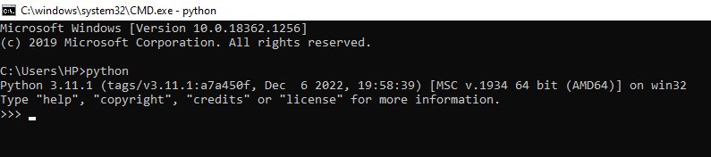
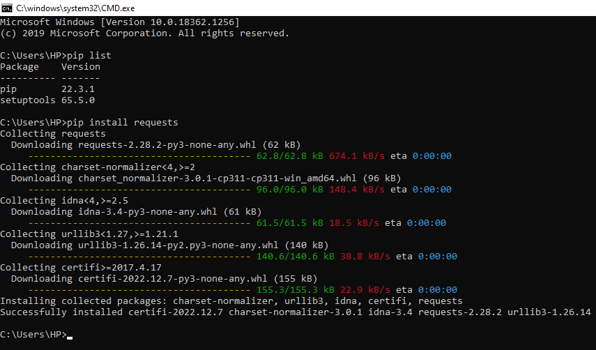
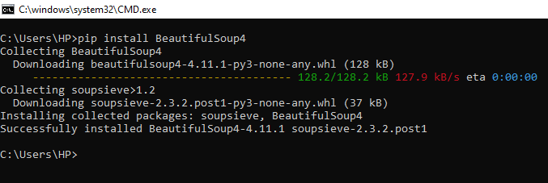
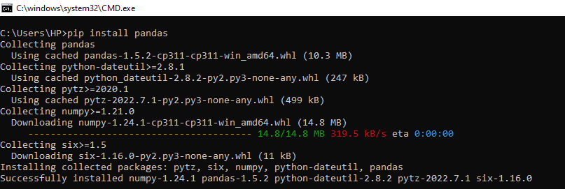
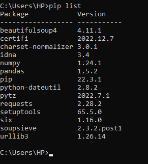
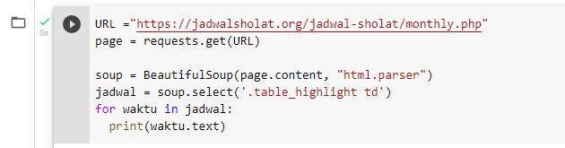
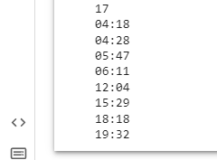

# Praktikum - 11

## PIP

1. PIP merupakan package manager untuk mengelola package dan modul pada python.
2. Denga menggunakan PIP, kita dapat menggunakan library yang tersedia bebas dari directory package library python.

## Perintah Dasar PIP

1. pip --version : untuk menampilkan versi PIP yang terinstall
2. pip install nama_package : untuk menginstall package
3. pip uninstall nama_package : untuk menghapus package
4. pip list : untuk menampilkan daftar pavkage yang terinstall

# Web Scraping Menggunakan Python

## Definisi

- Secara umum, Web Scraping adalah proses pengambilan data tertentu dari website.
- Ada dua teknik dalam Web Scraping yaitu, Manual dan Otomatis.

## Tools Yang Digunakan

- Python
- Requests
- BeautifulSoup
- Google Colab

# Python

## Langkah Installasi

1. Kunjungi tautan dibawah ini untuk menginstall aplikasi Python terlebih dahulu.
https://www.python.org/

2. Setelah aplikasi berhasil di unduh, silahkan install Python 3.11.1 yang sudah di unduh.

## Proses Pengecekan Python

1. Setelah selesai menginstall python, selanjutnya adalah membuka Command Prompt atau CMD pada Laptop 

2. Setelah itu, ketik 'Python' untuk melihat versi Python yang sudah di Install

## Requests

1. Requests merupakan library HTTP untuk proses mengirim data menggunakan protokol HTTP

2. Untuk menginstallnya menggunakan perintah 'pip install requests', contohnya seperti dibawah ini :

## BeautifulSoup

1. BeautifulSoup merupakan library yang digunakan untuk proses web scraping halaman HTML dan XML.

2. Untuk menginstallnya menggunakan perintah 'pip install BeautifulSoup', contohnya seperti dibawah ini :

## Pandas

1. Pandas adalah library open source pada Python yang sering digunakan untuk memproses data yang meliputi pembersihan data, manipulasi data, hingga melakukan analisis data.

2. Untuk menginstallnya menggunakan perintah 'pip install pandas', contohnya seperti dibawah ini :

## PIP List Python

1. Untuk melihan daftar package yang sudah terinstall, kita bisa menggunakan perintah 'pip list' untuk melihat daftar list package apa saja yang sudah berhasil di instal.

2. Untuk melihat daftar nya kita harus menggunakan perintah 'pip list', contohnya seperti dibawah ini :

# Google Colab

1. Untuk membuat Project menggunakan Google Colab, silahkan kunjungi tautan berikut ini : https://colab.research.google.com/

2. Kemudian klik File, setelah itu klik Buat Notebook baru.

3. Silahkan beri anma Project yang akan dibuat, disini saya akan menamai Project saya dengan nama 'Latihan-PIP'

4. Kemudian import library yang sudah di install, contohnya seperti dibawah ini :
.png)

5. Setelah itu, masukkan Program yang akan dijalankan (Disini saya menggunakan Program Studi Kasus : Jadwal Sholat) https://jadwalsholat.org/jadwal-sholat/monthly.php

6. Jika sudah benar, Program sudah bisa dijalankan. dan tampilan nya aka seperti yang dibawah ini :

